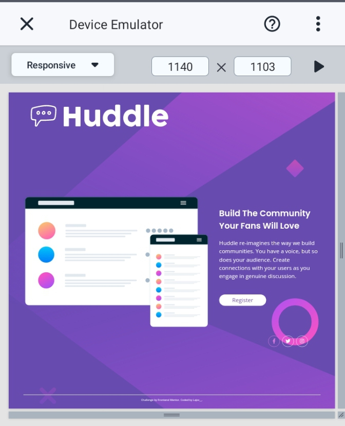

# Techathonian| Frontend Mentor - Huddle landing page with single introductory section solution

This is a solution to the [Huddle landing page with single introductory section challenge on Frontend Mentor](https://www.frontendmentor.io/challenges/huddle-landing-page-with-a-single-introductory-section-B_2Wvxgi0).

## Table of contents

- [Overview](#overview)
  - [The challenge](#the-challenge)
  - [Screenshot](#screenshot)
  - [Links](#links)
- [My process](#my-process)
  - [Built with](#built-with)
  - [What I learned](#what-i-learned)
  - [Continued development](#continued-development)
  - [Useful resources](#useful-resources)
- [Author](#author)
- [Acknowledgments](#acknowledgments)

## Overview

### The challenge

Users should be able to:

- View the optimal layout for the page depending on their device's screen size
- See hover states for all interactive elements on the page

### Screenshot

### Links

- Solution URL: [https://github.com/f-lajoc/Huddle-landing-page]
- Live Site URL: [Add live site URL here](https://your-live-site-url.com)

## My process

### Built with

- Semantic HTML5 markup
- CSS custom properties
- Flexbox
- Mobile-first workflow
- Media Query

### What I learned

I finally realized the benefit of using relative units which makes it easier for responsiveness

I figured a way to check for Responsiveness across several devices for free using the trebedit code editor on mobile phone--just by watching ads and i get to use their premium package for a day

I got better at using Media query

I started using flexbox

### Continued development

I'd continue using relative units, love to get better at using flexbox and then lay my hands on grid&animations

### Useful resources

- [Google search](https://www.google.com) - Random google search when i get stuck.
- [w3school](https://www.w3schools.com) - My go-to site when i forget somethings.

## Author

- Frontend Mentor - [@lajoc__](https://www.frontendmentor.io/profile/lajoc__)
- Twitter - [@lajoc__](https://www.twitter.com/lajoc__)

## Acknowledgments

[Techathon open-source community](https://twitter.com/Techathonian)
Techathon Mentor- Ace Adonis
